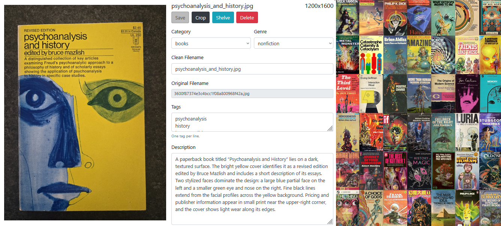

Image Tagger
============



A command-line utility that uses vision models to organize images.

Features
--------

Extract image metadata using a vision model, including categories, genres, tags, and
image descriptions.

Rename arbitrary image filenames to clean, human-readable filenames.

Normalize uploaded image formats by correcting mismatched extensions and converting
lossless or uncompressed formats to PNG and lossy formats to JPEG.

Prepare a static HTML gallery of images and metadata.

Move tagged images into configured library shelf directories.


CLI Usage
---------

You will need to put your OpenAI API key in the usual `OPENAI_API_KEY`
environment variable.

The upload workflow is available through `just` tasks:

```bash
just convert [DIRECTORY]
just tag [DIRECTORY]
just rename [DIRECTORY]
just clip [DIRECTORY]
just review [DIRECTORY]
just shelve [DIRECTORY]
just dedupe [DIRECTORY]
just wall [DIRECTORY]
just gallery [DIRECTORY]
just report [DIRECTORY]
```

`just convert` prepares uploads for tagging. It corrects image extensions when
the file contents do not match the name, converts lossless or uncompressed
formats such as BMP and GIF to PNG, converts lossy formats such as WEBP, AVIF,
and HEIC to JPEG, and normalizes `.jpeg` filenames to `.jpg`.

Pass `-w` or `--welcome-extensions` with a comma-delimited list to replace the
default welcome formats, such as `just convert uploads -w jpg` to convert every
other supported format to JPEG.

Every command uses a `.stackmap` configuration file. The CLI searches upward
from the directory where it was run, then falls back to `~/.stackmap`; pass
`--stackmap PATH` to use a specific file. Shelf names are identifiers, and
paths may be absolute or relative to the `.stackmap` file itself:

```yaml
default: shelves/inbox
art: shelves/art # paintings, drawings, and other visual art
books: shelves/books
```

An inline comment after a shelf path is passed to the tagging prompt as guidance
for that category; it does not change the shelf identifier or path.

If `DIRECTORY` is omitted, tools use the `default` shelf. The `default` shelf
is an inbox and never a tagging category; every other shelf name is the
authoritative category list passed to the vision model. Metadata is written to
`image_metadata.csv` inside the selected directory.

Every `DIRECTORY` argument also accepts a shelf alias. Aliases take precedence
over same-named local directories, while unknown names remain local relative
paths. For example, `just dedupe books` uses the configured `books` shelf, and
`just dedupe ghosts` uses `./ghosts` when `ghosts` is not configured.

`just tag` applies a vision language model (VLM) to tag and categorize images
in a structured dataset. It also determines a clean filename for each image
according to internal naming conventions. Multiple model providers are supported
([Download example CSV](https://olooney.github.io/image-tagger/docs/example/image_metadata.csv)).

`just clip` automatically applies a perspective transform to orthorectify (unskew) images.
It determines the correct transform using a combination of traditional computer vision
techniques (Hough transforms and largest-quadrilateral contour detection) and a VLM
([example](https://olooney.github.io/image-tagger/docs/example/transform_review.html)).

`just review` pulls up an interactive HTMX app to review and correct the
inferred tags and filenames. It provides an interactive crop tool that can
crop, resize, and apply perspective transforms to images. The crop tool
can use the same vision models as the `just clip` pipeline.
The review tool also allows you to shelve or delete images during the review process
([example](https://olooney.github.io/image-tagger/docs/example/review_screenshot.png)).

`just shelve` moves images into separate directories based on their inferred
(and human-reviewed) categories.

`just dedupe` removes duplicate images under `DIRECTORY`. CLIP scores at or
above `--automatic-threshold` are removed automatically; scores at or above
`--llm-threshold` are confirmed by the selected vision model before removal.
It maintains a cache of already compared images to avoid doing the full $O(n^2)$
comparison each time
([example](https://olooney.github.io/image-tagger/docs/example/dedupe_review.html)).

`just wall` creates an `index.html` image wall directly from every supported image
under `DIRECTORY`. It uses relative image paths, computes a median image aspect
ratio up front, and displays the images in equal-sized grid cells with a
click-to-open full-size overlay
([example](https://olooney.github.io/image-tagger/docs/example/wall.html)).

`just gallery` produces a static HTML version of the review tool showing the
image and its inferred metadata side-by-side
([example](https://olooney.github.io/image-tagger/docs/example/gallery.html)).

`just report` prints image totals, metadata breakdowns, outstanding metadata and
dedupe work, filename cleanup gaps, and the largest images in `DIRECTORY`.
It shows images larger than 1 MB by default; use `--large-image-threshold` with
values such as `500k` or `2 MB` to change that limit.
([example](https://olooney.github.io/image-tagger/docs/example/report_screenshot.png)).

Vision Models
-------------

Supported vision model providers are:

| Code | Provider | Model |
| --- | --- | --- |
| `openai` | OpenAI | `gpt-5.6-sol` |
| `gemma` | Ollama | `gemma4:e4b` |
| `qwen` | Ollama | `qwen3.5:4b` |

Python API
----------

You can also generate an `image_metadata.csv` file for a given directory of
images from Python like so:

```python
import image_tagger as it

filepaths = it.find_images(image_dir)
it.tag_images(filepaths, metadata_filename)
```

This file contains descriptions, tags, and other metadata that a vision model can
infer from the images.

The metadata CSV contains a column called `clean_filename` which suggests
a new, clean filename for each file in the format `lower_snake_case.png`.
To automatically rename all the images listed in the CSV to their suggested
clean filenames, you can use:

```python
it.rename_images(metadata_filename, verbose=1, dry_run=False)
```

Finally, with a `StackMap` loaded from your `.stackmap`, run:

```python
it.generate_gallery(metadata_filename, gallery_filename)
```

to generate a static `index.html` file which shows each image listed in
`image_metadata.csv` side-by-side with its inferred metadata. The gallery also has a
simple local search feature to demonstrate how the inferred metadata enables
better image searching.

To move renamed images into sibling directories matching the tagged category,
such as `../books/`, create those directories first and run:

```python
it.shelve_images(metadata_filename, stackmap=stackmap, verbose=1, dry_run=False)
```

Source
------

This [Jupyter notebook](https://github.com/olooney/image-tagger/blob/main/notebooks/Image%20Tagger%20Test.ipynb)
contains a usage example, including test-image generation by scrambling
filenames and several summary visualizations.

The main
[`image_tagger.py`](https://github.com/olooney/image-tagger/blob/main/src/image_tagger.py)
contains the core tagging, renaming, shelving, and gallery code. The default
vision-model instructions live in
[`image_prompt.md`](https://github.com/olooney/image-tagger/blob/main/src/image_tagger_data/image_prompt.md)
and are loaded as `IMAGE_PROMPT_TEMPLATE`. Pass `--instructions-filename` on
the CLI, or `instructions_filename` from Python, to use a different prompt
template without editing the package data. The `csv_columns` variable contains
the names and order of the columns of the generated `image_metadata.csv` file.

